# Besouro

[](https://www.npmjs.com/package/besouro)
[](LICENSE)
[](#requirements)

On-device developer tools for React Native and Expo. Tap the floating bubble, get
twelve inspectors. No laptop, no remote debugger.

- **Network**: every request, with copy as cURL
- **Console**: logs, uncaught errors, and native crashes recovered on the next launch
- **WebSocket** and **Socket.IO**: messages and events in both directions
- **Notifications**: Expo, Firebase and Notifee, plus the device push token
- **Redux**, **Zustand** and **Jotai**: actions, live state, and what changed
- **AsyncStorage** and **MMKV**: every operation, and for MMKV the stored contents
- **Element**: tap any component to read and edit its props
- **Files**: browse and share the app's sandbox

## Requirements

- **New Architecture** only
- **React Native** 0.77+
- **Expo** SDK 53+, in a dev build (Expo Go can't load native code)

## Installation

```sh
npm install besouro
```

It ships a native module, so rebuild:

```sh
# Expo
npx expo run:ios          # or run:android

# Bare React Native
cd ios && pod install
npx react-native run-ios  # or run-android
```

## Quick start

```ts
// src/besouro.ts
import { Besouro } from 'besouro';

Besouro.init();
```

```js
// index.js, before your app code
if (__DEV__) {
  require('./src/besouro');
}
```

Import it as early as possible. Anything that runs first is not captured: a socket
opened at module load, a fetch fired before the app renders.

Want to enable Besouro in QA or release builds? See
[Shipping a release build with Besouro](#shipping-a-release-build-with-besouro).

## Enabled by default

### Network

<div>
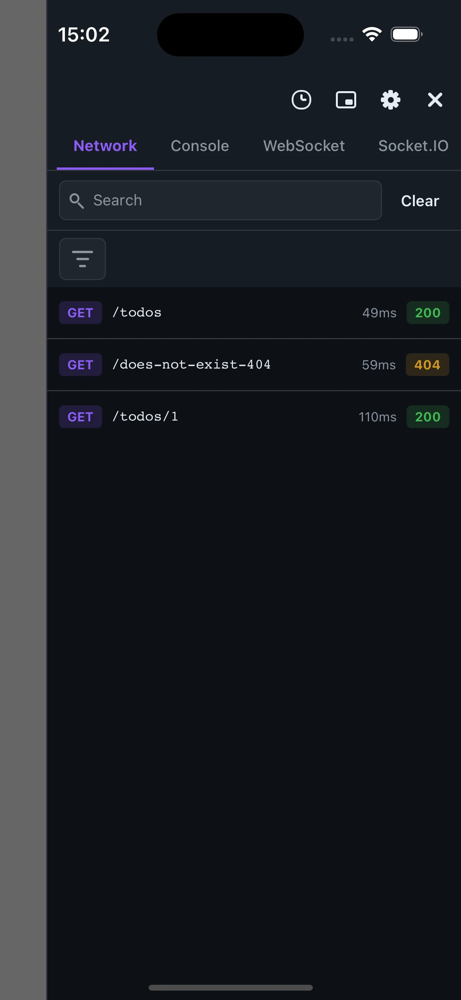
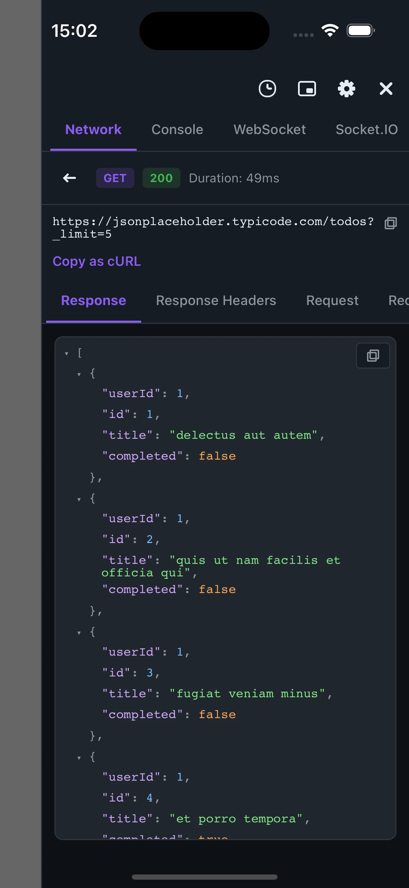
</div>

### Console

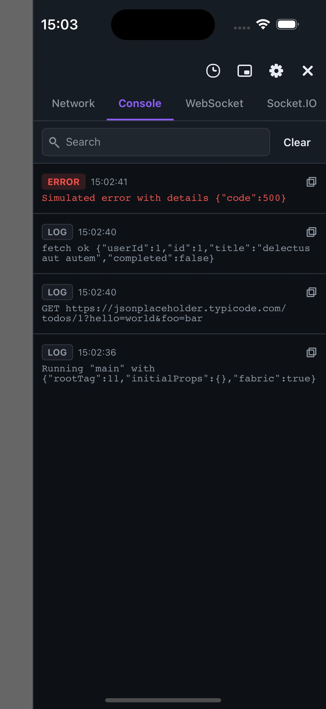

### WebSocket

<div>
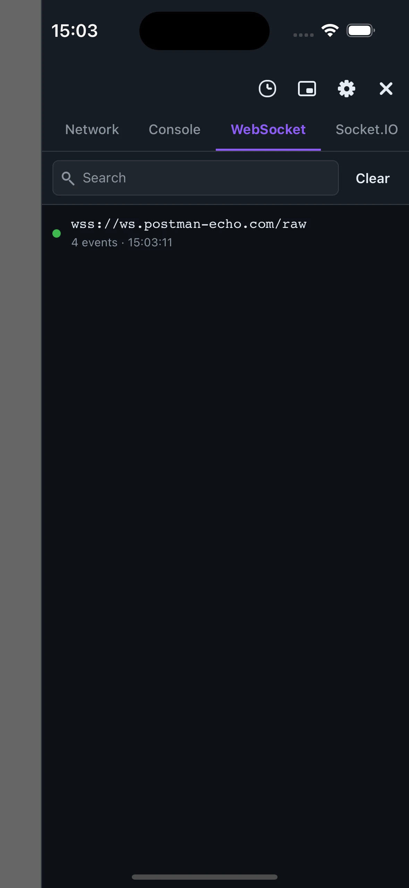
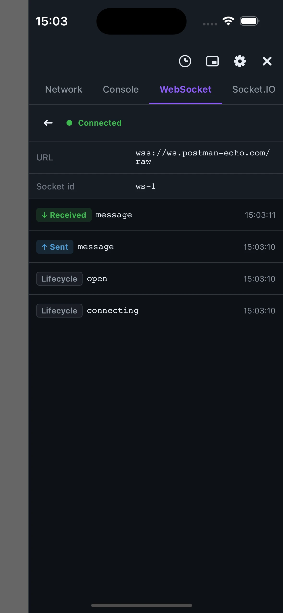
</div>

### Element

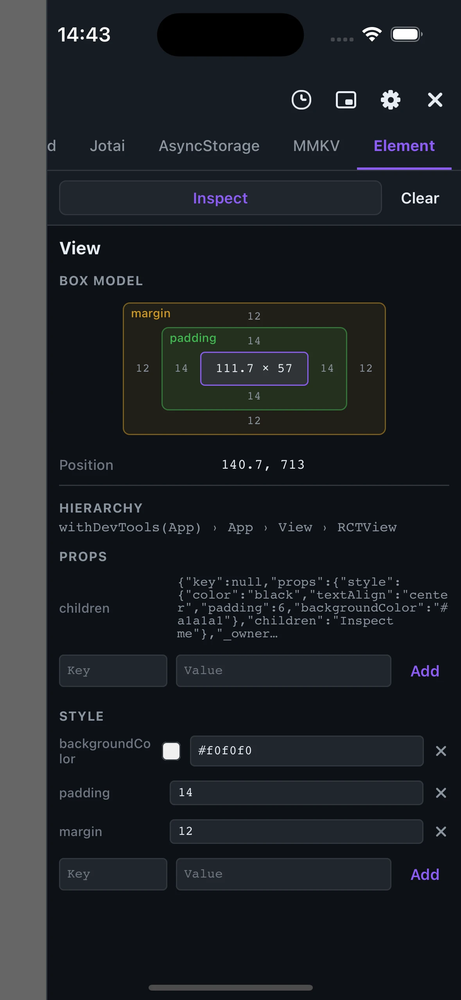

### Files

<div>
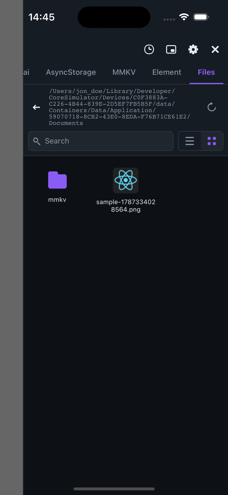
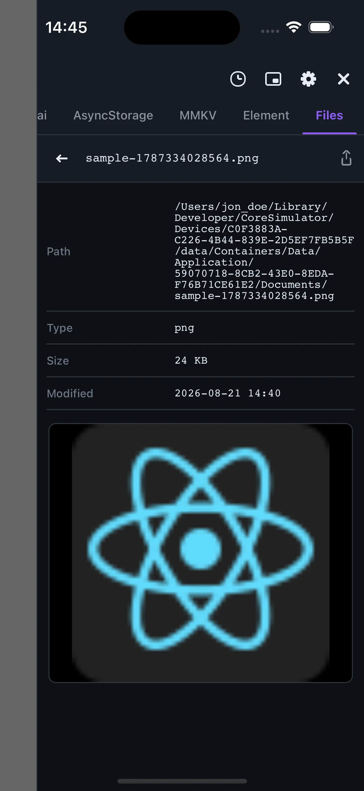
</div>

## State Management

### Redux

```ts
// src/besouro.ts
import { Besouro } from 'besouro';
import { combineReducers, configureStore, createSlice } from '@reduxjs/toolkit';

const counterSlice = createSlice({
  name: 'counter',
  initialState: { value: 0 },
  reducers: {
    increment: (state) => {
      state.value += 1;
    },
  },
});

export const rootReducer = combineReducers({ counter: counterSlice.reducer });
export const store = configureStore({ reducer: rootReducer });

Besouro.redux(store, rootReducer).init();
```

<div>
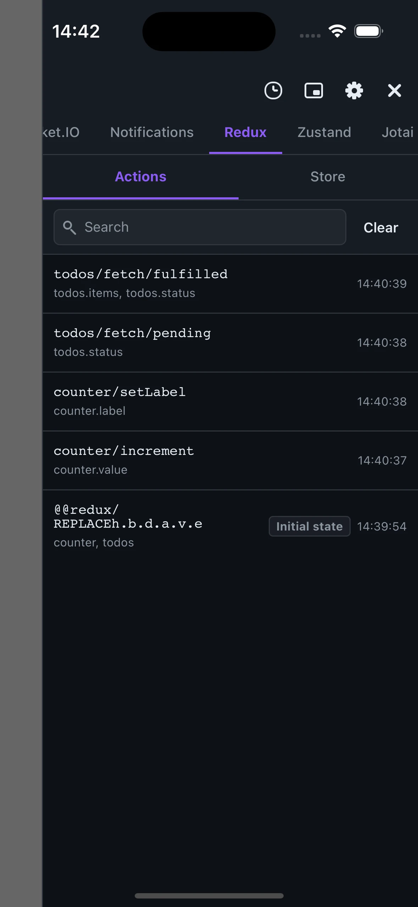
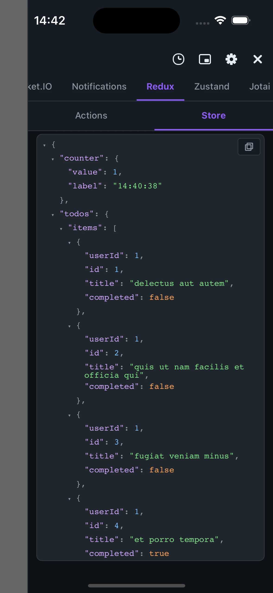
</div>

Pass the root reducer too, or `createAsyncThunk` and RTK Query actions never show
up. One store per app.

### Zustand

```ts
// src/besouro.ts
import { Besouro } from 'besouro';
import { create } from 'zustand';

export const useCounterStore = create<{ count: number }>(() => ({ count: 0 }));

Besouro.zustand({ counter: useCounterStore }).init();
```

<div>
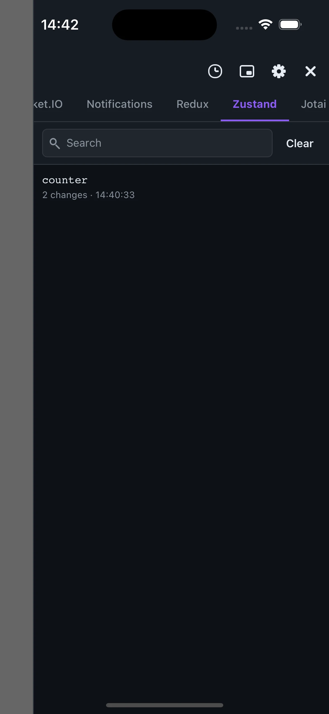
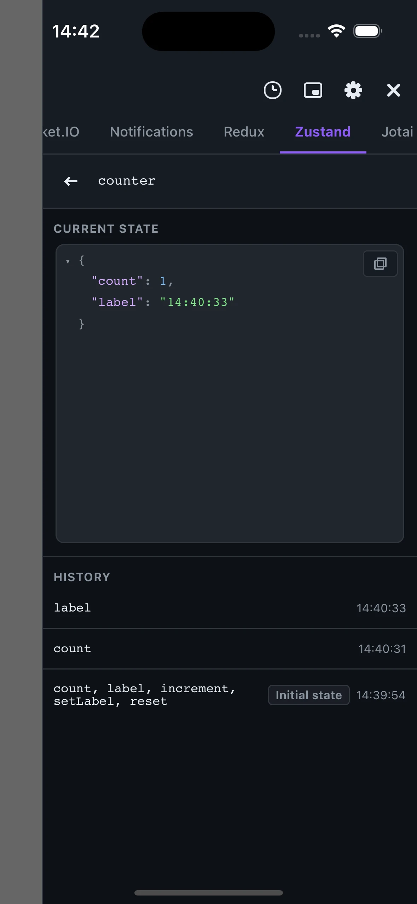
</div>

The key becomes the store's name in Besouro, `counter` here.

### Jotai

```ts
// src/besouro.ts
import { Besouro } from 'besouro';
import { atom, getDefaultStore } from 'jotai';

export const countAtom = atom(0);
export const stepAtom = atom(1);

Besouro.jotai(getDefaultStore(), {
  count: countAtom,
  step: stepAtom,
}).init();
```

<div>
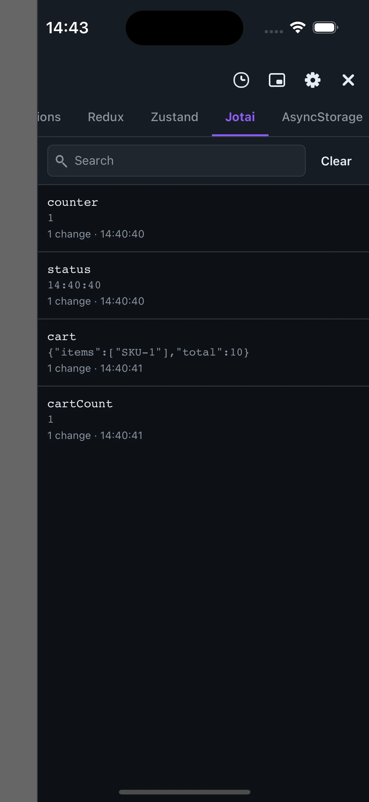
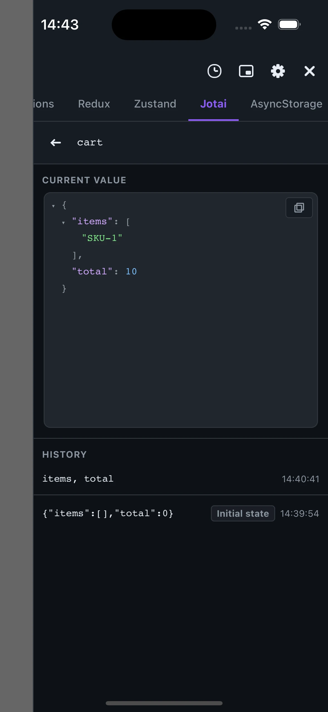
</div>

Only the atoms you name are captured.

## Storage

### AsyncStorage

```ts
// src/besouro.ts
import { Besouro } from 'besouro';
import AsyncStorage from '@react-native-async-storage/async-storage';

Besouro.asyncStorage(AsyncStorage).init();
```

<div>
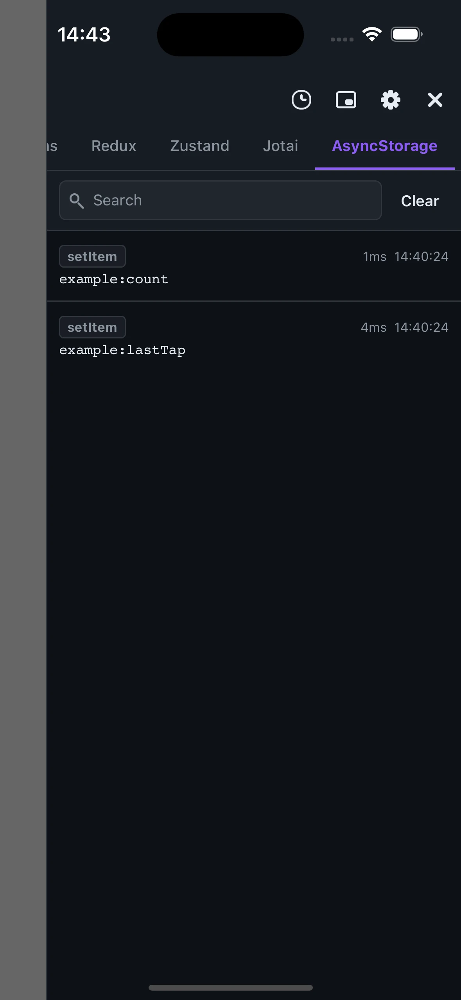
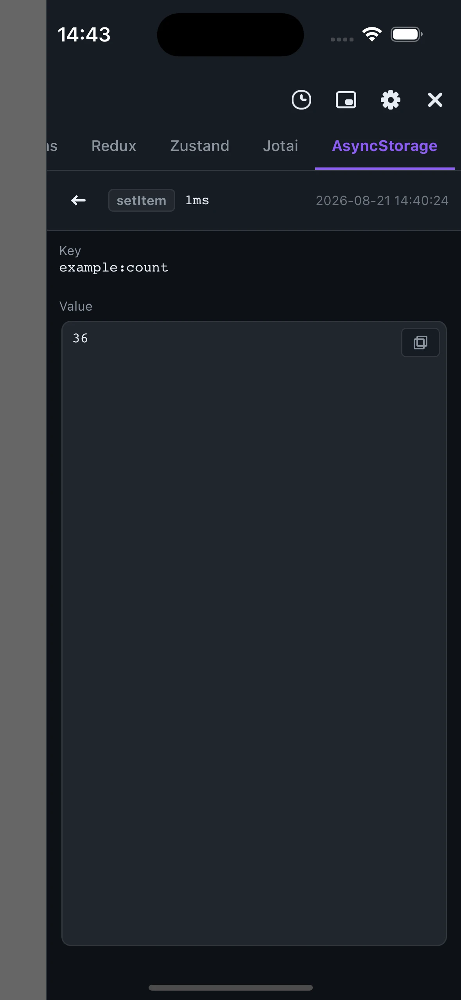
</div>

### MMKV

Requires react-native-mmkv v4.

```ts
// src/besouro.ts
import { Besouro } from 'besouro';
import { createMMKV } from 'react-native-mmkv';

export const storage = createMMKV();
export const settings = createMMKV({ id: 'settings' });

Besouro.mmkv({ default: storage, settings }).init();
```

<div>
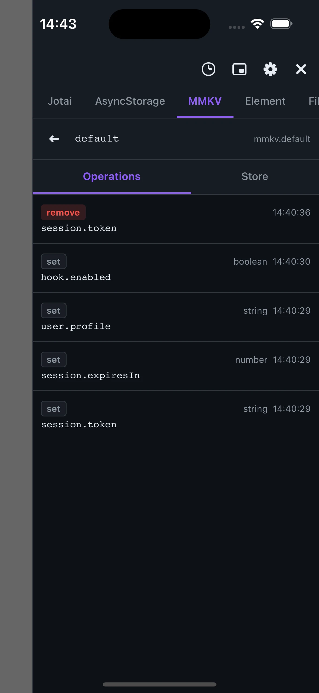
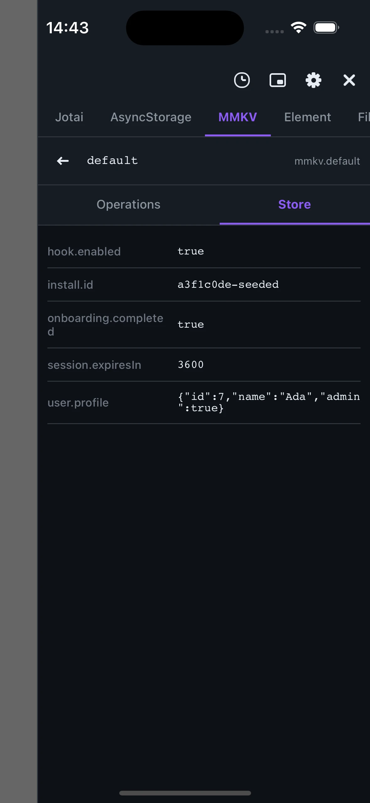
</div>

## Socket.IO

```ts
// src/besouro.ts
import { Besouro } from 'besouro';
import { Manager } from 'socket.io-client';

Besouro.socketIO(Manager).init();
```

<div>
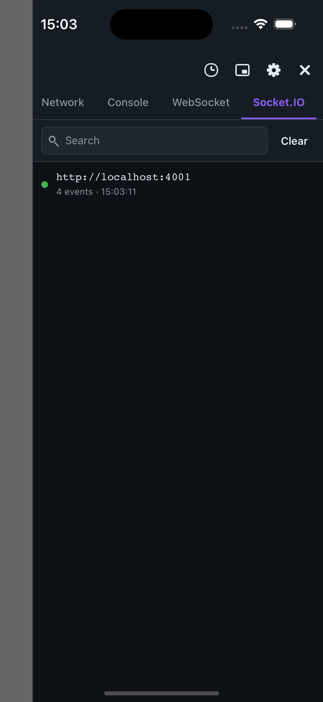
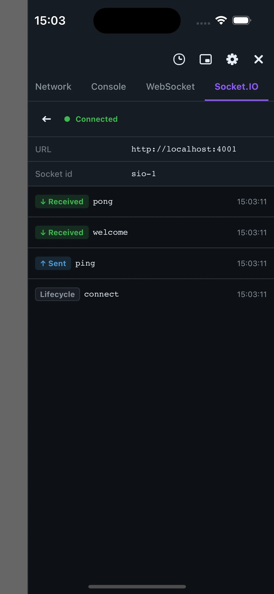
</div>

## Notifications

```ts
// src/besouro.ts
import { Besouro } from 'besouro';
import * as Notifications from 'expo-notifications';
import messaging from '@react-native-firebase/messaging';
import notifee from '@notifee/react-native';

Besouro.notifications({
  expoNotifications: Notifications,
  firebaseMessaging: messaging,
  notifee,
}).init();
```

<div>
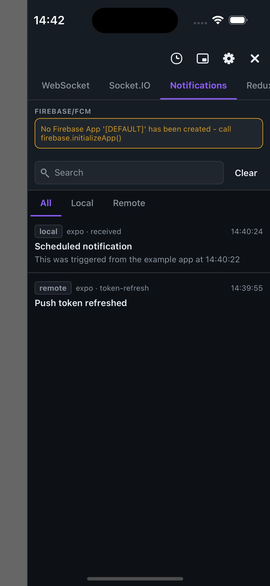
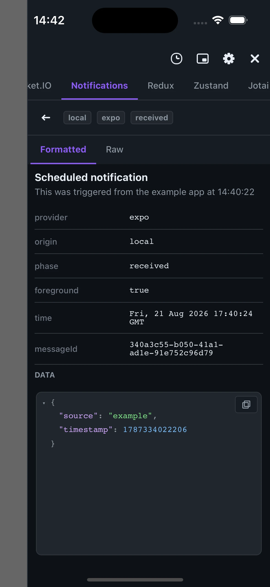
</div>

## Full example

```ts
// src/besouro.ts
import { Besouro } from 'besouro';
import AsyncStorage from '@react-native-async-storage/async-storage';
import { Manager } from 'socket.io-client';
import { getDefaultStore } from 'jotai';
import notifee from '@notifee/react-native';

import { store, rootReducer } from './app/store';
import { useCartStore } from './stores/cart';
import { cartAtom, userAtom } from './state/atoms';
import { storage, settings } from './stores/mmkv';

Besouro.configure({ accent: '#7c3aed' })
  .redux(store, rootReducer)
  .zustand({ cart: useCartStore })
  .jotai(getDefaultStore(), { cart: cartAtom, user: userAtom })
  .asyncStorage(AsyncStorage)
  .mmkv({ default: storage, settings })
  .socketIO(Manager)
  .notifications({ notifee })
  .init();
```

## Options

```ts
// src/besouro.ts
import { Besouro } from 'besouro';

Besouro.configure({
  maxSessions: 30,
  theme: 'dark',
  accent: '#7c3aed',
  locale: 'pt',
  inspectors: { fileSystem: false },
}).init();
```

| Option        | Default     | Notes                                                                   |
| ------------- | ----------- | ----------------------------------------------------------------------- |
| `maxSessions` | `10`        | Sessions kept on disk; older ones pruned at launch                      |
| `theme`       | `'system'`  | `'system' \| 'light' \| 'dark'`                                         |
| `accent`      | theme's own | `'#rrggbb'`                                                             |
| `locale`      | `'system'`  | `'system' \| 'en' \| 'pt' \| 'es'`                                      |
| `inspectors`  | all on      | Switch off `network`, `console`, `websocket`, `element` or `fileSystem` |

## Session history

Every launch is a session, kept on disk. Reopen a previous one; a run that ended in a
crash is marked **Crashed**.

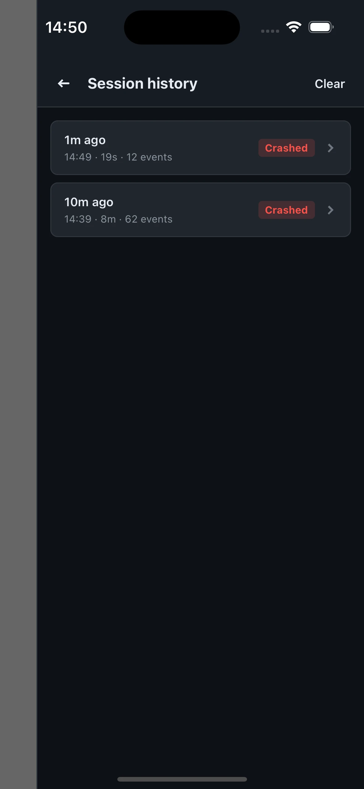

## Native crashes

A crash that takes the whole process down (a Kotlin/Java exception, a Swift
`fatalError`, a `SIGSEGV`) shows up in **Console** on the next launch, under the
session that died.

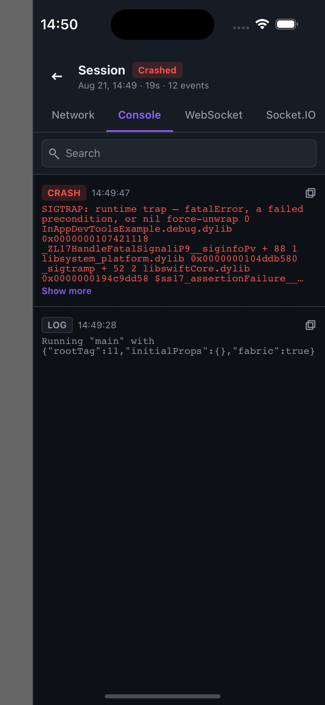

## Settings

Theme, accent, text size, language (English, Portuguese, Spanish) and tab order,
changeable at any time.

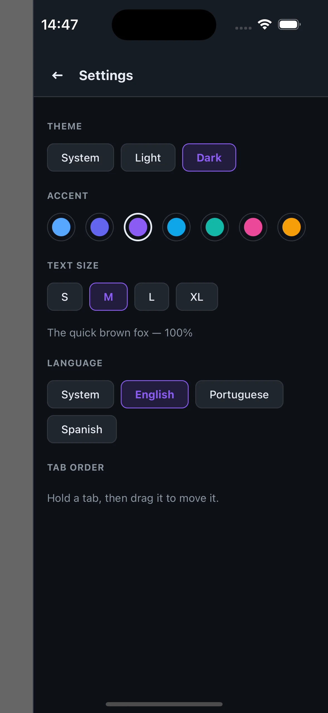

## Shipping a release build with Besouro

Sometimes you need Besouro in a release-mode build: a QA flavor, an internal
beta, a release candidate you're chasing a bug in. Keep the config in one file and
require it behind a flag that build sets, so your store release still drops it.

```js
// index.js: the require is the switch
if (__DEV__ || process.env.EXPO_PUBLIC_BESOURO === '1') {
  require('./src/besouro');
}
```

The flag has to be build-time, not runtime: an env var your bundler inlines, or a
constant a build script swaps. A runtime check keeps the library in every bundle.

## Security

Everything captured is stored raw in the app's sandbox: request and response bodies,
headers, tokens, cookies, whatever the app logged. Session history keeps it across
launches. Fine on your own device; treat any build that ships Besouro as internal
only, and don't hand one to anyone you wouldn't hand the data to.


## Contributing

- [Development workflow](CONTRIBUTING.md#development-workflow)
- [Sending a pull request](CONTRIBUTING.md#sending-a-pull-request)
- [Code of conduct](CODE_OF_CONDUCT.md)

## License

MIT

---

Made with [create-react-native-library](https://github.com/callstack/react-native-builder-bob)
